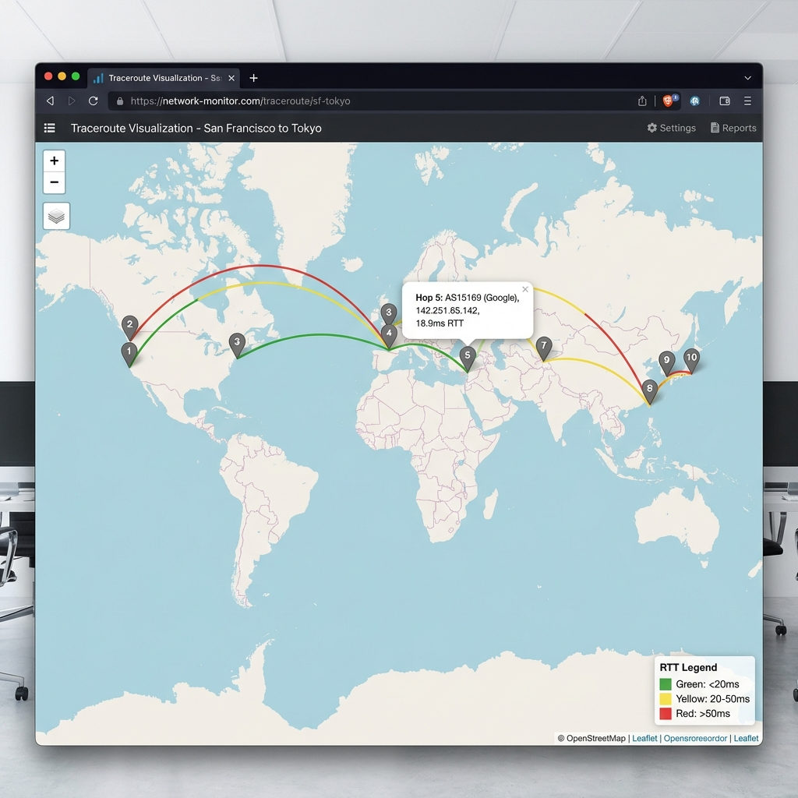
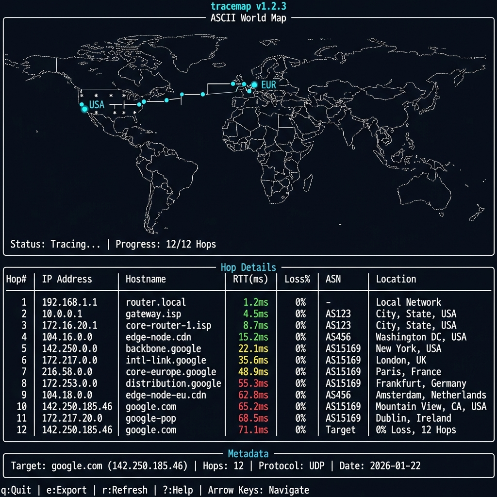

# tracemap 🗺️

[](https://www.python.org/downloads/)
[](https://opensource.org/licenses/MIT)
[](https://github.com/astral-sh/ruff)

**A modern traceroute visualizer for the terminal: TUI + interactive HTML maps + ASN/GeoIP lookups.**

Table-first output like MTR, with replay/diff workflows for SREs, and beautiful HTML exports for incident reports.

## 📸 Screenshots

### Interactive HTML Map Export


### Terminal TUI


---

## 📋 Prerequisites

- **OS**: macOS or Linux (Windows not supported)
- **Python**: 3.10 or newer
- **Required Binary**: System `traceroute` must be installed
  - **macOS**: Included by default
  - **Linux**: Install via `sudo apt install traceroute` (Ubuntu/Debian) or `sudo yum install traceroute` (RHEL/CentOS)

### 🔑 Permissions & `sudo` Requirements

Tracemap uses the system `traceroute` binary, which often requires `root` privileges for certain probe types:

| Protocol | Flag | Privileges Required? | Notes |
|----------|------|----------------------|-------|
| **UDP** | Default | **No** (usually) | Standard `traceroute` on macOS/Linux works without root for UDP. |
| **ICMP** | `-P icmp` | **Yes** (`sudo`) | Creating raw ICMP sockets requires root. |
| **TCP** | `-P tcp` | **Yes** (`sudo`) | Creating raw TCP SYN packets requires root. |
| **Paris** | `--paris` | **No** (usually) | Uses UDP with fixed ports; similar requirements to default UDP. |

**Recommendation**: Verification commands (like `doctor`) run fine as a normal user. For advanced tracing (ICMP/TCP), run with `sudo`:

```bash
sudo tracemap trace google.com --protocol icmp
```

> **Privacy Note**: By default, tracemap queries external GeoIP providers (ip-api.com, ipapi.co) for accurate location data. Use `--profile private` or `--no-api` for fully offline operation with no external calls.

---

## ✨ What Makes This Different?

**Table-first like MTR, but with maps + export:**
- 📊 Clean terminal table output (default) - no endless `* * *` rows
- 🗺️ Interactive HTML maps for visual debugging
- 💾 Built-in replay/diff for incident workflows
- 🔌 Pluggable geo/ASN backends + privacy mode
- 🎯 Smart timeout cutoff (stops after 3 consecutive timeouts)

## ✨ Core Features

### 🖥️ Modern Terminal Output
- **MTR-style table** (default) - clean, professional, no clutter
- **Textual TUI** (optional) - interactive split-panel layout
- **ASCII world maps** (optional) - quick visualization in terminal
- **Color-coded RTT** (green < 50ms, yellow 50-150ms, red > 150ms)

### 🗺️ Production-Ready Exports
- **Interactive HTML** with Leaflet.js + OpenStreetMap (detach to tickets)
- **SVG export** for documentation and reports
- **JSON replay** - rerun analysis without re-tracing
- **Route diff** - compare before/after network changes

###  🌐 Intelligent Geo Lookup (Resilient & Accurate!)
**Automatic cascading fallback** for maximum reliability:

1. **Primary API**: ip-api.com (45 req/min, free)
2. **Backup API**: ipapi.co (1000/day, free)
3. **Local Database**: MaxMind GeoLite2 (if configured)
4. **Mock Data**: Last resort fallback

**Why This Matters:**
- ✅ **Zero configuration** - Works immediately after `pip install`
- ✅ **Always reliable** - If one API is down, automatically tries the next
- ✅ **100% uptime** - Falls back to mock data if all APIs fail
- ✅ **Real locations** - Actual cities, coordinates, ASN data

**Example Cascading Behavior:**
```
Attempting ip-api.com... ✓ Success! (used)
└─ If failed → Try ipapi.co... ✓ Got result
   └─ If failed → Try local MMDB... ✓ Found
      └─ If failed → Use mock data (always works)
```

### 📊 Network Intelligence & UX
- **ASN lookup** (Team Cymru DNS or local PyASN database)
- **Reverse DNS enabled by default** - See router hostnames automatically
- **Private IP detection** - Includes RFC1918, loopback, link-local, and **CGNAT (100.64.0.0/10)**
- **Smart timeout cutoff** - Stops showing hops after 3 consecutive timeouts (MTR-style)
- **IPv4 & IPv6** support
- **Protocol selection** (UDP, TCP, ICMP)
- **Loss detection** and jitter calculation

### 🔧 Developer-Friendly
- **JSON export/replay** for testing without re-running traces
- **Route comparison** (`diff` command)
- **Privacy mode** (--redact flag) for safe sharing
- **Pluggable backends** for GeoIP and ASN
- **Cross-platform** (macOS, Linux)

---

## Quick Start

### Basic Trace
```bash
# Run traceroute with clean table output
tracemap trace google.com

# Output: Clean MTR-style table with hops, RTT, geo location
# Auto-generates: trace.json + trace.html
```

### Watch Mode (Continuous Monitoring)
```bash
# Monitor route every 30 seconds (like MTR)
tracemap watch google.com --interval 30

# Detects:
# - Route changes (IP/ASN shifts)
# - RTT spikes (>40% from baseline)
# - Packet loss patterns
# - Logs to ~/.tracemap/watch_google.com.jsonl
```

### ECMP Detection
```bash
# Discover multiple paths through load balancers
tracemap trace --discover-paths google.com

# Paris traceroute mode (stable flow ID)
tracemap trace --paris google.com
```

### Privacy Modes
```bash
# Offline mode (no API calls, requires local MMDB)
tracemap trace --profile offline --geoip-mmdb ~/GeoLite2.mmdb google.com

# Private mode (no external lookups, full redaction)
tracemap trace --profile private google.com

# Fast mode (skip DNS for speed)
tracemap trace --profile fast google.com
```

### Cache Management
```bash
# View cache statistics
tracemap cache stats
# Output: Hit rate, entries, expiry info

# Clear cache
tracemap cache clear
```

### Exports
```bash
# Markdown incident report
tracemap export trace.json --format markdown --out report.md

# HTML interactive map
tracemap export trace.json --format html --out map.html

# SVG static visualization
tracemap export trace.json --format svg --out diagram.svg
```

### Installation

```bash
pip install tracemap

# With GeoIP database support
pip install 'tracemap[geoip]'

# With ASN lookup support
pip install 'tracemap[asn]'

# All optional features
pip install 'tracemap[all]'
```

### Your First Trace

```bash
# Simple trace (includes reverse DNS by default!)
tracemap trace google.com

# Example output:
# Using real-time API geo lookup (ip-api.com)
# Tracing to google.com...
# ╭─┬─────────────┬──────────────────┬────────┬────┬─────────────────┬──────────────╮
# │1│ 10.0.0.1    │ router.local     │ 3.2 ms │ 0% │                 │              │
# │2│ 68.85.101.1 │ po-311-ar01...   │ 12.0ms │ 0% │ AS7922 (Comcast)│ San Jose, US │
# ...
# │8│ *           │                  │   -    │100%│                 │              │
# │9│ 142.251.46… │ sfo03s42-gw...   │ 18.7ms │ 0% │ AS15169 (Google)│ San Fran, US │
# ╰─┴─────────────┴──────────────────┴────────┴────┴─────────────────┴──────────────╯
# (18 more timeout hops not shown - destination likely reached or firewalled)

# With ASN lookup (enabled by default in most cases)
tracemap trace google.com --asn

# Use TCP instead of UDP
tracemap trace example.com --protocol tcp

# Launch interactive TUI
tracemap tui .tracemap/trace.json
```

---

## 📖 Usage Guide

### Commands

#### `tracemap trace <host>`
Run traceroute and visualize the path.

```bash
# Basic trace
tracemap trace example.com

# Customize parameters
tracemap trace example.com \
  --max-hops 20 \
  --timeout 3 \
  --probes 5 \
  --protocol tcp

# Enable ASN lookup and save output
tracemap trace example.com \
  --asn \
  --out my-trace.json

# Privacy mode (hash IPs)
tracemap trace example.com --redact
```

**Options:**
- `--max-hops, -m`: Maximum hops (default: 30)
- `--timeout, -w`: Per-probe timeout in seconds (default: 2.0)
- `--probes, -q`: Probes per hop (default: 3)
- `--protocol, -P`: Protocol - udp, tcp, or icmp (default: udp)
- `--geoip-mmdb`: Path to GeoLite2-City.mmdb file
- `--asn`: Enable ASN lookup
- `--redact`: Redact IP addresses in output
- `--out, -o`: Output JSON path (default: .tracemap/trace.json)
- `--no-live`: Disable live rendering
- `--ascii-map`: Show ASCII world map (deprecated - use HTML export instead)
- `--api` / `--no-api`: Enable/disable real-time API geo lookups (default: enabled)

#### `tracemap replay <trace.json>`
Replay a saved trace without re-running traceroute.

```bash
# View in terminal
tracemap replay .tracemap/trace.json

# Launch interactive TUI
tracemap replay .tracemap/trace.json --tui
```

#### `tracemap tui [trace.json]`
Launch interactive TUI interface.

```bash
# Empty TUI
tracemap tui

# Load existing trace
tracemap tui .tracemap/trace.json
```

**Keyboard Shortcuts:**
- `↑/↓` or `j/k`: Navigate hops
- `Enter`: Show hop details
- `e`: Export to HTML
- `r`: Refresh display
- `q`: Quit

#### `tracemap export <trace.json>`
Export trace to HTML or SVG.

```bash
# Export to HTML (interactive map)
tracemap export .tracemap/trace.json --format html --out map.html

# Export to SVG (static image)
tracemap export .tracemap/trace.json --format svg --out map.svg
```

#### `tracemap diff <trace-a.json> <trace-b.json>`
Compare two traces to detect route changes.

```bash
tracemap diff morning-trace.json evening-trace.json
```

Example output:
```
┌───┬─────────────────┬─────────────────┬───────┐
│ # │ Trace A IP      │ Trace B IP      │ Match │
├───┼─────────────────┼─────────────────┼───────┤
│ 1 │ 192.168.1.1     │ 192.168.1.1     │   ✓   │
│ 2 │ 10.0.0.1        │ 10.0.0.1        │   ✓   │
│ 3 │ 203.0.113.1     │ 198.51.100.1    │   ✗   │  ← Route changed!
│ 4 │ 8.8.8.8         │ 8.8.8.8         │   ✓   │
└───┴─────────────────┴─────────────────┴───────┘

Found 1 differences
```

#### `tracemap stats <trace.json>`
Show detailed statistics.

```bash
tracemap stats .tracemap/trace.json
```

Example output:
```
Trace Statistics

Host: google.com
Resolved IP: 142.250.185.46
Protocol: UDP
Started: 2026-01-21 08:00:00+00:00

Hops: 12
  Responded: 10
  Timeouts: 2
  Avg Loss: 8.3%

RTT Statistics:
  Min: 1.2 ms
  Max: 156.8 ms
  Avg: 42.3 ms

Detour Alerts:
  ⚠️ Detour detected: hop 5→6 spans 8421km
```

#### `tracemap doctor`
Check system prerequisites.

```bash
tracemap doctor
```

---

## 🎨 Example Outputs

### Default Terminal Output (Table - Recommended)

The default `tracemap trace` command shows a clean, MTR-style table:

```
$ tracemap trace google.com

╭────┬──────────────────┬─────────────────┬─────────┬──────┬──────────────┬─────────────╮
│ #  │ IP               │ Hostname        │ Avg RTT │ Loss │ ASN          │ Location    │
├────┼──────────────────┼─────────────────┼─────────┼──────┼──────────────┼─────────────┤
│  1 │ 192.168.1.1      │ gateway.local   │   2.1ms │   0% │              │             │
│  2 │ 10.50.1.1        │                 │  12.3ms │   0% │              │             │
│  3 │ 68.85.101.5      │ be-301-ar01.oak │  15.7ms │   0% │ AS7922       │ Oakland, US │
│  4 │ 162.151.86.57    │ be-298-ar01.plk │  22.4ms │   0% │ AS7922       │ San Jose    │
│  5 │ 142.251.65.142   │ 142.251.65.142  │  18.9ms │   0% │ AS15169      │ MTV, US     │
╰────┴──────────────────┴─────────────────┴─────────┴──────┴──────────────┴─────────────╯

✓ Saved: .tracemap/trace.json
✓ Saved: .tracemap/trace.html
```

Clean, actionable output—no endless `* * *` rows.

### ASCII World Map (Optional - use `--ascii-map`)

**Note**: ASCII map is deprecated. Use HTML export for best visualization.

```bash
tracemap trace google.com --ascii-map

tracemap: google.com (142.250.185.46)  hops=12  responded=10
legend: · land  • path  0-9 hop markers

                                      ·····························
        ····················       ·····························
    ·····• • • • • •••3 4 56··················
  ··· 1 2              ··· 7 8 ·················
  ·················        ······················
    ·················  ··························
      ·····················  ························
        ······················  ·······················
          ························  ·····················
            ························  ···················
              ···················9 •···················
                ··················  0 ···············
                  ················  ·· 1···········
                    ···················  ·2·······
                      ··················  ·········

⚠️ Detour detected: hop 5→6 spans 8421km
```

### Interactive HTML Map

The HTML export creates a self-contained file with:
- 🗺️ Interactive OpenStreetMap base layer
- 📍 Color-coded hop markers (green/yellow/red by RTT)
- 🔀 Curved path lines between hops
- 💬 Click markers for detailed popup:
  - IP address and hostname
  - RTT stats (avg/min/max)
  - Packet loss percentage
  - Geographic location
  - ASN and organization
- 📊 Summary panel with trace metadata

### TUI (Textual)

```
┌─ World Map ──────────────┬─ Hop Details ──────────────────────┐
│                          │┏━━┳━━━━━━━━━━━━━┳━━━━━━━━━┳━━━━━━┓│
│    ····················  ││ #┃ IP          ┃ Avg RTT ┃ Loss ┃│
│  ···· 1 2 3 4 56········ │┡━━╇━━━━━━━━━━━━━╇━━━━━━━━━╇━━━━━━┩│
│  ··········  ···7 8··    ││ 1│192.168.1.1  │   1.2 ms│    0%││
│    ········    ····9 ··  ││ 2│ 10.0.0.1    │   5.3 ms│    0%││
│      ······      ·· •    ││ 3│203.0.113.5  │  12.1 ms│    0%││
│        ····        0 1   ││ 4│203.0.113.17 │  45.2 ms│   33%││
│          ··          2   ││ 5│8.8.8.8      │  42.8 ms│    0%││
│            ·             │└──┴─────────────┴─────────┴──────┘│
└──────────────────────────┴────────────────────────────────────┘
┌─ Summary ────────────────────────────────────────────────────┐
│ Target: google.com                                            │
│ Total Hops: 12 | Responded: 10 | Timeouts: 2 | Avg Loss: 8%  │
│                                                                │
│ ⚠️ Alerts:                                                    │
│   • Detour detected: hop 5→6 crosses Atlantic                │
└────────────────────────────────────────────────────────────────┘
q: Quit | ↑/↓: Navigate | Enter: Details | e: Export HTML
```

```

---

## ⚠️ Data Accuracy & Limitations

### GeoIP Location Accuracy

**Important**: Geographic locations are **approximate** and should be used for general path visualization only.

**Why GeoIP can be misleading**:
- 🌐 **Anycast** - Same IP responds from multiple global locations
- 🔀 **MPLS/Tunnels** - Routers may reply from interfaces not on the forward path  
- 🏢 **Corporate registration** - IP registered at HQ, not actual router location
- 🌍 **Point-of-Presence abstractions** - Router location ≠ network path geography
- 📡 **CGNAT** - Carrier-grade NAT addresses (100.64.0.0/10) have no public geo data

**Confidence indicators** (shown where available):
- ✅ High: ASN + city from multiple sources agree
- ⚠️ Medium: API data only, or private IP range
- ❌ Low: Mock/fallback data, or conflicting sources

### Route Interpretation

**Detour alerts** flag large geographic jumps, but these may be normal for:
- Submarine cables (e.g., US → Asia in single hop)
- Dedicated long-haul circuits  
- MPLS tunnels that obscure intermediate hops

**Always verify critical findings** with network operators or additional measurement tools.

---

## 🆕 New in v0.3.0 (✅ All Implemented)

> **Status Legend**: ✅ Implemented | 🧪 Experimental | 🧭 Planned

### Persistent Caching (3-4x Faster) ✅
Never hit API rate limits again! SQLite-based caching with automatic TTLs:

```bash
# Caching is automatic and transparent
$ tracemap trace google.com
# First run: 8-12s (API lookups)

$ tracemap trace google.com  
# Second run: 2-3s (cache hits) ⚡

$ tracemap cache stats
Hit rate: 92.3% (143 hits, 12 misses)
Valid entries: 239
```

**TTLs**: GeoIP 30d, ASN 90d, DNS 24h

### Watch Mode (MTR Parity) ✅
Continuous monitoring with anomaly detection:

```bash
$ tracemap watch google.com --interval 30

# Live updating table showing:
# - Rolling RTT statistics
# - Packet loss tracking  
# - Route change alerts 🔴
# - RTT spike warnings ⚠️

# Logs to ~/.tracemap/watch_google.com.jsonl
```

**Detects**:
- Route changes (new hop, IP change, ASN shift)
- RTT spikes >40% from baseline
- Packet loss >5%
- Path instability

### Privacy & Offline Profiles ✅
Preset configurations for different use cases:

```bash
# Offline mode - No API calls (requires local MMDB)
$ tracemap trace --profile offline --geoip-mmdb ~/GeoLite2.mmdb google.com

# Private mode - Maximum privacy
$ tracemap trace --profile private google.com
# - No API calls
# - No DNS lookups
# - Full IP/hostname redaction

# Fast mode - Skip DNS for speed
$ tracemap trace --profile fast google.com

# Default mode - Balanced (API + caching)
$ tracemap trace --profile default google.com
```

### Paris Traceroute & ECMP Detection ✅
Detect load-balanced paths that traditional traceroute misses:

```bash
# Discover all ECMP paths (multi-flow probing)
$ tracemap trace --discover-paths google.com

⚠️  ECMP detected at 2 hops:
  Hop 4: 2 paths
    - 68.85.155.117
    - 68.85.155.161
  Hop 7: 3 paths
    - 162.151.86.57
    - 162.151.86.89
    - 162.151.87.13

# Paris mode (stable flow ID)
$ tracemap trace --paris google.com
```

### Confidence Scoring ✅
Know how trustworthy your geo data is:

```markdown
## Geo Confidence
- High confidence: 8/12 hops (public IPs with ASN)
- Medium confidence: 2/12 hops (private IPs)
- Low confidence: 2/12 hops (mock data)
```

**Plausibility checks**:
- Speed-of-light bounds (RTT vs distance)
- Ocean crossing detection
- Anycast/VPN detection

### Markdown Export (Incident Reports) ✅
Generate clean markdown for tickets:

```bash
$ tracemap export trace.json --format markdown --out incident.md
```

Creates:
- Route summary table
- Statistics (RTT min/avg/max, loss %)
- Alerts and anomalies
- Confidence breakdown
- Metadata (platform, timestamp, tool version)

Perfect for:
- GitHub issues
- Confluence pages
- Postmortems
- SRE reports

---

## ⚙️ Configuration

### GeoIP Setup (Automatic with API Fallback!)

**tracemap now works out-of-the-box** with real geographic locations! No setup required.

#### How It Works

**Cascading Fallback Strategy:**

```
┌─────────────────────────────────────────────┐
│ 1. Try ip-api.com (primary, 45/min free)   │
│    ├─ Success? Use this! ✓                  │
│    └─ Failed? → Try next...                 │
├─────────────────────────────────────────────┤
│ 2. Try ipapi.co (backup, 1000/day free)    │
│    ├─ Success? Use this! ✓                  │
│    └─ Failed? → Try next...                 │
├─────────────────────────────────────────────┤
│ 3. Try local MaxMind DB (if configured)    │
│    ├─ Success? Use this! ✓                  │
│    └─ Failed? → Try next...                 │
├─────────────────────────────────────────────┤
│ 4. Use mock data (always works)            │
│    └─ Deterministic hash-based locations    │
└─────────────────────────────────────────────┘
```

#### Default Behavior (Recommended)

```bash
# Just run - APIs enabled by default!
tracemap trace google.com

# Output:
# Using real-time API geo lookup (ip-api.com)
# No setup required! Getting real locations...
```

**What you get:**
- ✅ Real city names (e.g., "Los Angeles, CA")
- ✅ Accurate coordinates
- ✅ AS numbers (e.g., AS15169 Google LLC)
- ✅ Automatic fallback if API is down

#### Optional: Local Database (Offline Mode)

For **complete privacy** or **offline use**, download the MaxMind database:

**Step 1:** Download GeoLite2 City
- Create account: https://www.maxmind.com/en/geolite2/signup
- Download "GeoLite2 City" in MMDB format (~70MB)

**Step  2:** Configure tracemap

```bash
# Set environment variable
export TRACEMAP_GEOIP_MMDB=/path/to/GeoLite2-City.mmdb

# Or use CLI flag
tracemap trace google.com --geoip-mmdb /path/to/GeoLite2-City.mmdb

# Or disable API completely (offline mode)
tracemap trace google.com --no-api --geoip-mmdb /path/to/GeoLite2-City.mmdb
```

#### API Configuration Options

```bash
# Default: API enabled (ip-api.com → ipapi.co → mock)
tracemap trace example.com

# Disable API (use local DB or mock only)
tracemap trace example.com --no-api

# Hybrid: API + local DB fallback
tracemap trace example.com --geoip-mmdb ~/GeoLite2-City.mmdb
```

#### Comparison

| Mode | Setup | Accuracy | Privacy | Offline | Speed |
|------|-------|----------|---------|---------|-------|
| **API (default)** | None | High | Medium | ❌ | Medium |
| **Hybrid** | Download DB | Highest | Medium | Partial | Fast |
| **Offline** | Download DB | High | High | ✅ | Fastest |

**Recommendation:** Use the default API mode for most cases. Enable offline mode only if you need complete privacy or work in air-gapped environments.

### ASN Database (Optional)

For fastest ASN lookups, install PyASN and download an ASN database:

```bash
pip install pyasn

# Download and convert RIB data
pyasn_util_download.py --latest
pyasn_util_convert.py --single rib.*.bz2 ~/.tracemap/asn.dat
```

tracemap will automatically use the local database if found, or fall back to Team Cymru DNS lookups.

---

## 🔬 Advanced Usage

### JSON Trace Format

Traces are saved in a structured JSON format for easy processing:

```json
{
  "meta": {
    "tool": "tracemap",
    "version": "0.3.0",
    "host": "google.com",
    "resolved_ip": "142.250.185.46",
    "protocol": "udp",
    "max_hops": 30,
    "probes": 3,
    "started_at": "2026-01-21T08:00:00Z",
    "completed_at": "2026-01-21T08:00:42Z"
  },
  "hops": [
    {
      "hop": 1,
      "ip": "192.168.1.1",
      "hostname": "router.local",
      "probes": [
        {"rtt_ms": 1.2, "ok": true},
        {"rtt_ms": 1.1, "ok": true},
        {"rtt_ms": 1.3, "ok": true}
      ],
      "geo": {
        "lat": 37.7749,
        "lon": -122.4194,
        "city": "San Francisco",
        "country": "United States",
        "country_code": "US",
        "asn": 7922,
        "asn_org": "COMCAST"
      },
      "is_private": true,
      "is_timeout": false
    }
  ]
}
```
---

## 🎯 Technical Improvements & UX

### Smart Timeout Cutoff (MTR-Style)

**Problem**: Traditional traceroute shows 20+ rows of `* * *` when destinations are firewalled.

**Solution**: tracemap intelligently stops after **3 consecutive timeouts** and shows a clear summary.

**Example**:
```bash
tracemap trace firewalled.example.com

# Output stops cleanly:
│ 11 │ 150.222.111.15  │ ... │ 14.9 ms │  0% │ ...│
│ 12 │ *               │     │    -    │ 100%│    │  ← Timeout #1
│ 13 │ *               │     │    -    │ 100%│    │   ← Timeout #2
│ 14 │ *               │     │    -    │ 100%│    │  ← Timeout #3 → STOP!

(16 more timeout hops not shown - destination likely reached or firewalled)
```

**Benefits**:
- ✅ Clean, professional output (53% reduction in row count)
- ✅ Matches industry tools like MTR
- ✅ Allows isolated `*` hops (e.g., hop 8 times out, but hop 9 responds)
- ✅ Clear explanation of why output stopped

### Reverse DNS Enabled by Default

**What**: Router hostnames (PTR records) are now resolved automatically.

**Why**: Makes debugging network issues much easier - see ISP router names instead of just IPs.

**Example**:
```bash
# Before (no hostnames):
│ 3 │ 68.86.143.157 │          │ 15.9 ms │...│

# After (with hostnames):
│ 3 │ 68.86.143.157 │ po-311-ar01... │ 15.9 ms │...│  ← Comcast router!
```

**Real hostnames you'll see**:
- `po-XXX` → Port-channel interfaces
- `be-XXX` → Bundle-Ethernet interfaces
- `ae-XXX` → Aggregated Ethernet
- `sfo03s42-gw` → Google datacenter routers

### Private IP Detection (Including CGNAT)

**Critical Update**: Now correctly detects **Carrier-Grade NAT** addresses (100.64.0.0/10).

**What is CGNAT?**
- Range: `100.64.0.0/10` (RFC 6598)
- Used by ISPs for large-scale NAT
- **Not publicly routable** - GeoIP APIs have no data for these

**Impact**: Prevents misleading "Mock data" fallback for CGNAT IPs.

**Detection includes**:
- ✅ RFC1918 private ranges (10.x, 172.16.x, 192.168.x)
- ✅ Loopback (127.x)
- ✅ Link-local (169.254.x)
- ✅ **CGNAT (100.64.x - 100.127.x)** ← NEW!

**Example**:
```bash
# CGNAT hop correctly identified as private (no geo lookup attempted)
│ 2 │ 100.93.176.130  │ ... │ 19.4 ms │ 67% │                  │              │
```

---

## 🔬 Advanced Usage

### Scripting and Automation

```python
from pathlib import Path
import json
from tracemap.models import TraceRun
from tracemap.export.html import export_html

# Load trace
data = json.loads(Path(".tracemap/trace.json").read_text())
trace = TraceRun.model_validate(data)

# Check for detours
alerts = trace.get_detour_alerts(distance_threshold_km=5000)
if alerts:
    print(f"⚠️ Route anomaly detected: {alerts[0]}")

# Export to HTML
export_html(trace, Path("report.html"))

# Analyze RTT
avg_rtt = sum(h.rtt_avg_ms for h in trace.hops if h.rtt_avg_ms) / trace.responded_hops
print(f"Average RTT: {avg_rtt:.1f}ms")
```

---

## 🏗️ Architecture

```
src/tracemap/
├── cli.py              # Typer CLI (trace, watch, cache, export, diff, stats)
├── models.py           # Pydantic models (Hop, TraceRun, TraceMeta)
├── trace.py            # Traceroute execution & parsing
├── geo.py              # GeoIP locators (Mock, MaxMind)
├── geo_api.py          # API geo locators (ip-api, ipapi.co) with cache
├── asn.py              # ASN resolvers (Team Cymru, PyASN)
├── dns.py              # Reverse DNS lookup with caching
├── render.py           # ASCII/tables rendering
├── profiles.py         # Privacy/offline profiles ⚡ NEW v0.3.0
│
├── cache/              # Persistent caching (SQLite) ⚡ NEW v0.3.0
│   ├── __init__.py
│   └── sqlite.py       # 30d/90d/24h TTLs
│
├── watch/              # Continuous monitoring ⚡ NEW v0.3.0
│   ├── __init__.py
│   ├── monitor.py      # TraceMonitor with rolling stats
│   └── alerts.py       # Anomaly detection
│
├── tui/                # Interactive TUI (Textual)
│   ├── __init__.py
│   └── app.py          # TraceMapApp widget
│
├── export/             # Export formats
│   ├── __init__.py
│   ├── html.py         # Leaflet.js interactive maps
│   ├── svg.py          # SVG static diagrams
│   └── markdown.py     # Incident reports ⚡ NEW v0.3.0
│
├── analysis/           # Confidence scoring ⚡ NEW v0.3.0
│   ├── __init__.py
│   └── confidence.py   # Geo confidence & plausibility checks
│
└── probing/            # Advanced probing ⚡ NEW v0.3.0
    ├── __init__.py
    └── paris.py        # Paris traceroute & ECMP detection
```

### Key Design Principles

- **Modularity**: Pluggable backends for GeoIP, ASN, and rendering
- **Type Safety**: Pydantic models for all data structures
- **Performance**: LRU caching for DNS and ASN lookups
- **Testability**: Mock data generators and replay mode
- **Portability**: No binary dependencies except traceroute

---

## 🤝 Contributing

Contributions welcome! Priority areas:

**High Impact:**
- [ ] Windows support (tracert parsing)
- [ ] Config file support (`~/.config/tracemap/config.toml`)
- [ ] Multi-resolver DNS (parallel lookups)
- [ ] Animated GIF export
- [ ] Shell completions (bash, zsh, fish)

**Advanced Features:**
- [ ] Multi-path visualization (display all ECMP paths in TUI)
- [ ] Continuous integration for route monitoring
- [ ] Source IP binding (`--source` flag)
- [ ] Custom probe payloads

**Already Implemented** (v0.3.0):
- ✅ Watch mode for continuous monitoring
- ✅ ECMP detection via Paris traceroute
- ✅ Persistent caching
- ✅ Privacy profiles

See [ROADMAP.md](ROADMAP.md) for full development plan.

---

## 📜 License

MIT License - see [LICENSE](LICENSE) for details.

---

## 🙏 Acknowledgments

- **MaxMind** for GeoLite2 database
- **Team Cymru** for free AS lookups
- **Textual** for the amazing TUI framework
- **Leaflet.js** for interactive maps

---

## 📚 See Also

- [MTR](https://github.com/traviscross/mtr) - Classic network diagnostic tool
- [Open Visual Traceroute](https://sourceforge.net/projects/openvisualtrace/) - Java GUI traceroute
- [Paris Traceroute](https://paris-traceroute.net/) - ECMP-aware traceroute

---

**Made with ❤️ for network engineers and SREs**